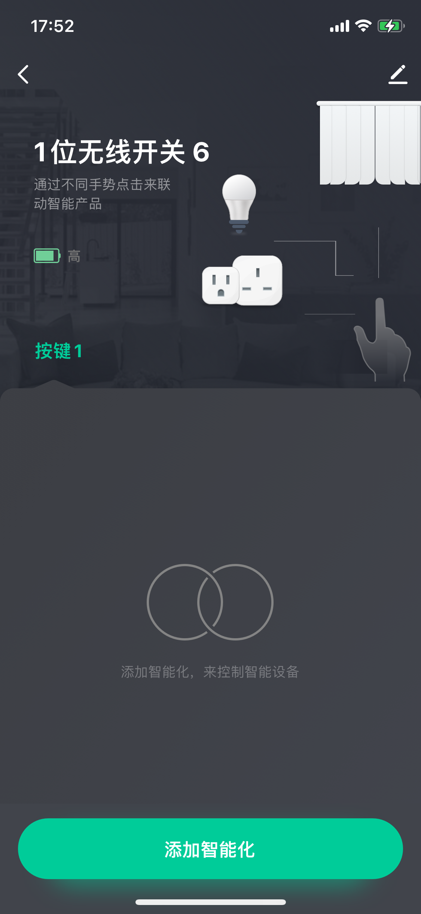

# tuya_wireless_switch_1_gang
based JN5169 model JN5169模块

#### 说明
- 支持涂鸦tuya 一位无线开关接入涂鸦zigbee网关，支持控制涂鸦zigbee网关情景，单击、双击、长按三种模式
- 可以直接刷入小米/绿米一位无线开关(JN5169芯片)，使其接入涂鸦网关
- 工作在低功耗模式

#### JN5169 NXP开发环境搭建
- 参考其他说明
- 为了减小仓库体积，sdk/Tools没有添加跟踪

